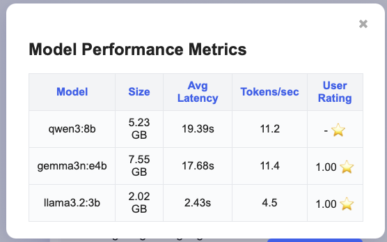
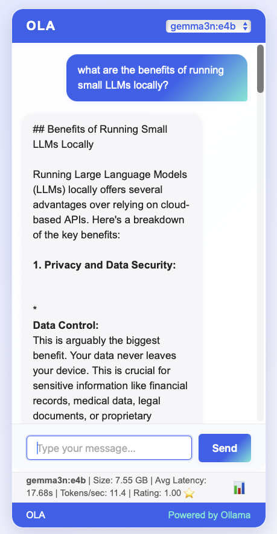

# OLA

A minimal OLLAMA wrapper webapp for exploring and chatting with local AI models. OLA provides a clean REST API and a simple frontend for rapid prototyping, testing, and experimenting with open-source LLMs—all running privately on your machine.

## Features
- List available Ollama models
- Chat with selected models
- Simple REST API
- Static web frontend (in `public/`)

## Performance Metrics

OLA tracks and exposes key performance metrics to help you evaluate and compare different models and configurations. Metrics include:

- Average model response time
- Token/second
- Ability to rate answers and see a user rating.

Metrics can be accessed via the API (see endpoint documentation) or viewed in the web UI (if implemented). These insights help you optimize your setup and choose the best models for your use case.



## Requirements
- Node.js (v16+ recommended)
- [Ollama](https://ollama.com/) running locally (default: `http://127.0.0.1:11434`)

## Installation
- Download [OLLAMA]from Ollama](https://ollama.com/) and follow instructions to pull models you want to test

```bash
# Install dependencies
$ npm install
```

## Usage

1. Make sure Ollama is running locally.
2. Start the server:

```bash
$ node server.js
```

3. Open your browser and go to [http://localhost:3000](http://localhost:3000)



## API Endpoints

- `GET /api/models` — List available Ollama models
- `POST /api/chat` — Chat with a selected model
  - Request body: `{ "model": "model-name", "messages": [ ... ] }`

## Project Structure

- `server.js` — Express backend
- `public/` — Static frontend files
- `.gitignore` — Node.js ignores

## Contributing

Pull requests are welcome
## License

MIT 